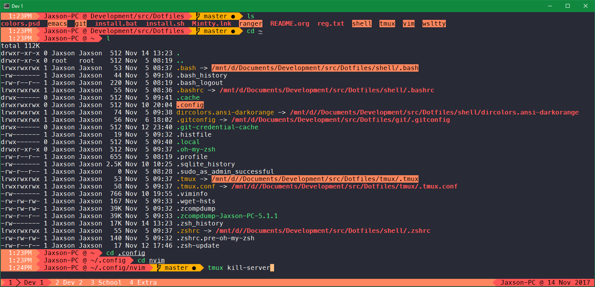

# Dircolors Orange

**Directory colors themes for GNU shells.**

*dircolors.ansi-darkorange* is slighly modfied version of *dircolors.ansi-dark*.

Forked from [dircolors-solarized](https://github.com/seebi/dircolors-solarized).

